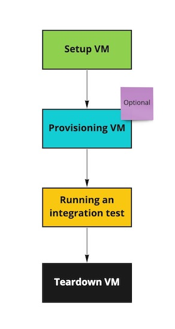

This article is for you, if you have to run VMs for your integration tests, and you use as a hypervisor - VM Ware 7.0
 or above.
 
The flow of each test case is the following: 



The participation of this library is for 2 blocks, to set up VM and to tear it down. 
In order to set up VM you have to choose which one you need. 
For that you are preparing it in your VMWare, like for example, `base-ubuntu20` and during the test run it will be cloned.
The image is cloned so that it can be reused multiple times, and you can run parallel tests. 

There are two ways to clone the VM, **clone** and **instant clone**:<br/> 
* **Clone** you can do on Powered off base images.<br/>
* **Instant clone** works only on images which are Powered on, because it happens on the memory level,
 and the clone process significantly faster. 

The operational process is happening via REST API. 

* First we open the session, and for that we have to know the API host of the VMWare and credentials. Credentials 
are provided as a base 64 encrypted hash of `username:password`. Once you have it you define it in your `overcast.conf` like:

```shell script title=overcast.conf
overcastVMWareHost { # this is an arbitrary name which will be used in your test to read the configuration section.
    ...
    vmwareApiHost=my_api_host 
    vmwareAuthHashCredentials=my_hash_credentials
    ... 
}
```  

* Then by VM name we have to find what is VM id is. To define the base image in overcast you have to add this property:

```shell script title=overcast.conf
overcastVMWareHost {
    ...
    vmBaseImage=my_base_image_name
    ...
}
```

* Having `sessionId` and `vmId` is enough to start the cloning. Though you can choose between the type of cloning. By 
default, it is **instant clone**, if by some reason you want to use a usual clone, you can add this line to the configuration:

```shell script title=overcast.conf
overcastVMWareHost {
    ...
    instantClone=false
    ...
}
```  

In my case, I got 120 seconds to clone CentOs 7, and 3 seconds to instantly clone the same image. 
The difference is phenomenal. But take into account that the base image has to be powered on for the instant clone.

* Then you are provisioning your VM, if it is required. You can for example use [Overthere](https://github.com/xebialabs/overthere)
for that. Or you can skip it and have already base image provisioned for your testing needs.

* After it's a time to execute the test logic itself.

* Once all is done, as the best practice, we have to utilise all our resources. For that we are shutting down the VM and
 deleting it.
 
 The snippet of the code which you can use as a scaffold for that is:
 
```java
    @Test
    public void shouldCloneAndDisposeVm() {
        VMWareHost h = (VMWareHost) CloudHostFactory.getCloudHost("overcastVMWareHost");
        try {
            h.setup();

            assertThat(h.getSessionId().length(), is(32));
            assertThat(h.getHostName(), notNullValue());
        } catch (Exception e) {
            fail(e.getMessage());
        } finally {
            h.teardown();
        }
    }
```


As we can see from here in this line <br/> 
```java 
VMWareHost h = (VMWareHost) CloudHostFactory.getCloudHost("overcastVMWareHost");
``` 

<br/> we 
are reading from the defined section `overcastVMWareHost`. The casting is not necessary here. <br/>
It is only to verify that session was properly created. As it is specified for VMWare implementation. 

After `h.setup()` you can do provisioning and writing your test scenario.  
